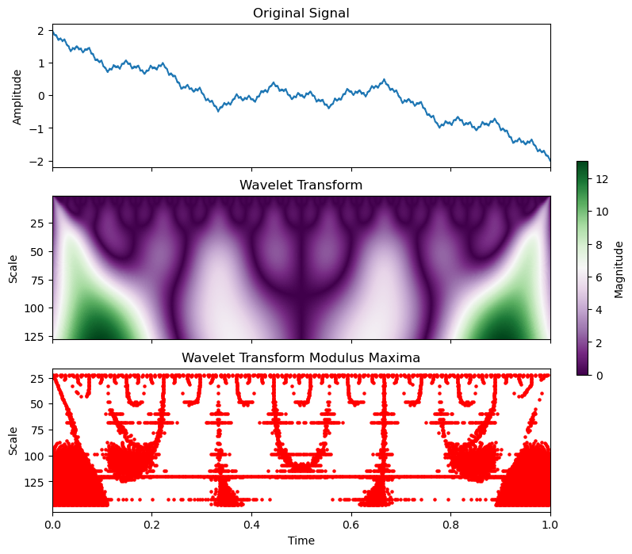

# Wavelet Transform Modulus Maxima (WTMM) Tutorial



## Introduction

The Wavelet Transform Modulus Maxima (WTMM) method is a powerful tool in signal processing and fractal analysis. It allows for the detection of singularities in signals—points where the signal behaves unusually, such as sharp transitions or changes in frequency. These singularities often correspond to critical features in the data, making WTMM particularly useful in various fields, including physics, biology, and finance.

The WTMM method leverages the continuous wavelet transform (CWT) to decompose a signal into different scales, making it possible to analyze its behavior at multiple resolutions. By identifying the maxima of the wavelet transform (modulus maxima), the WTMM method constructs a "skeleton" of the signal, which highlights the locations of these singularities across different scales.

## Motivation

Understanding singularities is crucial for analyzing complex signals that exhibit fractal properties, such as turbulence, stock market data, or biomedical signals like EEG. Traditional Fourier analysis often falls short in detecting these localized features because it provides information about the frequency content of the entire signal but lacks the resolution to capture changes at specific points. In contrast, the WTMM method offers a multi-scale analysis, allowing for a more detailed examination of the signal's structure and the identification of critical points.

This repository provides a step-by-step tutorial on applying the WTMM method to different types of signals, including those with interesting fractal properties like the Weierstrass function. By following this tutorial, you will gain an intuitive understanding of the WTMM method and how to implement it using Python.

## Repository Contents

- **`Wavelet Transform Modulus Maxima (WTMM) Tutorial.ipynb`**: A comprehensive Jupyter notebook that guides you through the implementation of the WTMM method on various signals. It includes detailed explanations, code snippets, and visualizations.
- **`wavelet.png`**: A figure that illustrates the results of applying the WTMM method to a sample signal.

## Getting Started

To get started with the tutorial, simply clone this repository and open the Jupyter notebook in your environment:

```bash
git clone https://github.com/galenwilkerson/wavelet-transform-modulus-maxima-WTMM-tutorial.git
cd wavelet-transform-modulus-maxima-WTMM-tutorial
jupyter notebook "Wavelet Transform Modulus Maxima (WTMM) Tutorial.ipynb"
```

## Relevant Concepts and Articles

To deepen your understanding of the concepts used in this tutorial, you may want to explore the following resources:

- **[Wavelet Transform](https://en.wikipedia.org/wiki/Wavelet_transform)**: An overview of the wavelet transform, a mathematical technique that decomposes a signal into different scales or resolutions.
- **[Modulus Maxima](https://en.wikipedia.org/wiki/Modulus_maxima)**: Information on modulus maxima, which are the points where the wavelet transform's magnitude reaches local maxima.
- **[Fractal Dimension](https://en.wikipedia.org/wiki/Fractal_dimension)**: An introduction to fractal dimension, a measure of how complex a fractal pattern is, and how it scales across different levels of magnification.
- **[Weierstrass Function](https://en.wikipedia.org/wiki/Weierstrass_function)**: A classic example of a continuous, nowhere-differentiable function that exhibits fractal properties.

## References

1. Mallat, S. G. (1992). A Wavelet Tour of Signal Processing. Academic Press.
2. Muzy, J. F., Bacry, E., & Arneodo, A. (1991). Wavelets and multifractal formalism for singular signals: Application to turbulence data. *Physical Review Letters, 67*(25), 3515.
3. Daubechies, I. (1992). Ten Lectures on Wavelets. SIAM.

## License

This project is licensed under the MIT License - see the [LICENSE](LICENSE) file for details.
